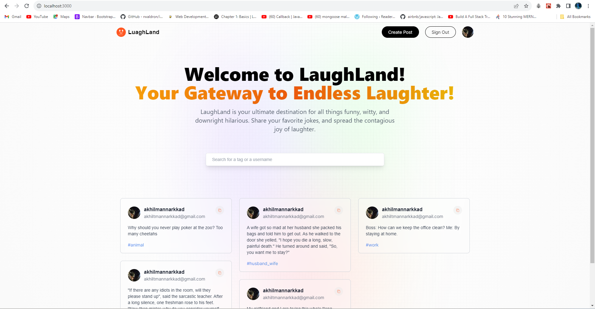

# Luaghland

Welcome to Luaghland, your go-to place for sharing and enjoying hilarious jokes!

## Features

- **Share Jokes:** Post your favorite jokes and share them with the Luaghland community.
- **Discover Humor:** Explore a vast collection of jokes submitted by users worldwide.
- **User Profiles:** Customize your profile and keep track of your joke contributions.
- **Categories:** Browse jokes based on categories like puns, dad jokes, and more.
- **Google Authentication:** Securely sign in to Luaghland using your Google account.
- **Search Functionality:**
  - **By Tags:** Easily find jokes by searching based on specific tags or keywords.
  - **By Usernames:** Explore jokes submitted by specific users by searching for their usernames.

## Tech Stack

- **Fullstack Framework:** Next.js 13
- **Styling:** Tailwind CSS
- **Authentication:** Google Authentication
- **Database:** MongoDB Atlas
- **API:** Next.js API Routes

## Luaghland Home Page




## Getting Started

### Local Development

1. **Fork the Repository:**

   - Click the "Fork" button in the top right corner of this repository to create your own copy.

2. **Clone the Repository:**

   ```bash
   git clone https://github.com/your-username/luaghland.git

   ```

3. **Navigate to the Project Directory:**

   ```bash
   cd luaghland

   ```

4. **Create an Environment File:**

   - Create a `.env.local` file at the root level of the project with the following content. Replace the placeholder values with your actual credentials.

     ```env
     GOOGLE_ID=your-google-client-id
     GOOGLE_CLIENT_SECRET=your-google-client-secret
     MONGODB_URI=your-mongodb-uri

     NEXTAUTH_URL=http://localhost:3000
     NEXT_URL_INTERNAL=http://localhost:3000
     NEXTAUTH_SECRET=your-nextauth-secret
     ```

5. **Install Dependencies:**

   ```bash
   npm install

   ```

6. **Start the Development Server:**

   ```bash
   npm run dev

   ```

7. **Access Luaghland Locally:**
   - Open your browser and visit [http://localhost:3000](http://localhost:3000).

## Pros of Using Next.js

- **Server-Side Rendering (SSR):** Improve SEO and initial page load performance with server-side rendering of pages.
- **Client-Side Rendering (CSR):** Enjoy interactive and dynamic user experiences with client-side rendering for subsequent page transitions.
- **File-Based Routing:** Organize your project intuitively using file-based routing, making it easy to understand and navigate.
- **API Routes:** Seamlessly create serverless functions to handle API requests within your Next.js application.

## About Luaghland

Luaghland is more than just a joke-sharing platform; it's a space to discover new forms of humor, and brighten your day with laughter. Our user-friendly interface makes it easy to share your favorite jokes, explore diverse categories, and engage with a community that appreciates the joy of laughter.

## Contributing

We welcome contributions from the community! If you have ideas for new features, bug fixes, or improvements, please submit a pull request. Be sure to follow our [contribution guidelines](CONTRIBUTING.md).

## Contact

For inquiries and support, you can reach me at
email: akhilthiruthiyottil@gmail.com.
